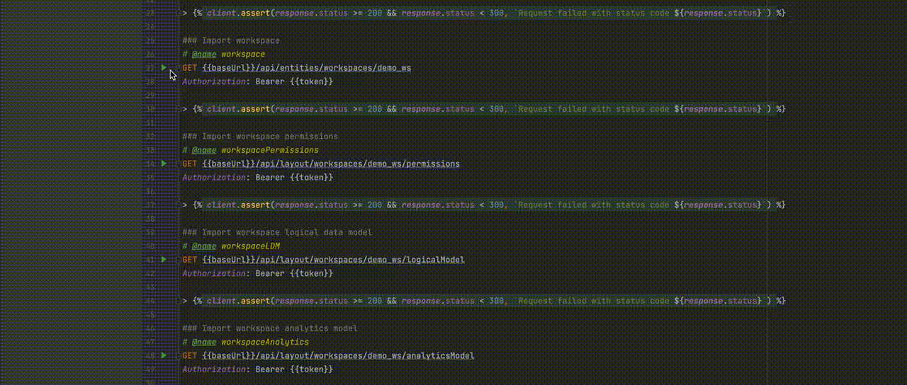

# GoodData declarative definitions

This repo contains a set of templates and CLI commands that you can use to manage
[GoodData.CN](https://www.gooddata.com/developers/cloud-native/) and GoodData Cloud workspaces in a declarative way.
Here is when you might want to use it:

* Version Control System (e.g. Git) integration for versioning, collaboration, CI/CD etc.
* Moving metadata between different environments.

## Folder structure

* [`definitions`](./definitions) folder contains an example definitions that you can use as a starting point. It's based on the demo project that can be automatically added to GoodData Cloud instance.
* [`scripts`](./scripts) folder contains a set of `.http` and `.js` files to handle metadata sync between `definitions` and GoodData server.
  * [`import.http`](./scripts/import.http) contains a set of HTTP request templates for importing declarative definitions from GoodData server.
  * [`create.http`](./scripts/create.http) is focusing on pushing the `definitions` to a fresh GoodData server instance. 
  * [`update.http`](./scripts/update.http) is focusing on pushing a new version of the `definitions` to an existing GoodData server instance.
  * [`toJson.js`](./scripts/toJson.js) is a helper script that converts YAML files to JSON before it's being uploaded to GoodData server. Typically, you would not need to update this file.
  * [`toYaml.js`](./scripts/toYaml.js) is a helper script that converts JSON definitions to YAML before saving them to `definitions` folder. Typically, you would not need to update this file.
* [`.github/workflows/cd.yaml`](.github/workflows/cd.yaml) contains an example CD pipeline that updates production server every time there is a new commit to master branch of this repository.

## Environment setup

The setup prepared in a way that you can edit and test individual requests in `.http` files in your favorite IDE.
For usage in CI/CD pipeline, we also have a set of scripts prepared in [`package.json`](./package.json) file. 

### Installing dependencies

Install [`NodeJS`](https://nodejs.org/en/) on your machine.

In terminal, navigate to the root folder of this repository and run `npm i`.
This will install all necessary dependencies for the CLI scripts that we are going to use.

### Configuring IDE

You should be able to edit `.http` files in any IDE that supports them natively or has an extension for them. We've tested
the setup in IntelliJ and VSCode.

#### IntelliJ IDEs

You don't need to do any special steps for IntelliJ family of IDEs (Idea, WebStorm, PyCharm etc.), as this IDEs
support running `.http` files out of box.

#### Visual Studio Code

For VSCode we recommend installing either [`httpYac`](https://marketplace.visualstudio.com/items?itemName=anweber.vscode-httpyac)
or [`httpBook`](https://marketplace.visualstudio.com/items?itemName=anweber.httpbook) extensions.

`httpYac` has a simple interface, similar to the popular REST Client extension. Unlike REST Client, it has a good
compatibility with IntelliJ-specific syntax, so you can have better cooperation in large teams, where different people
have different IDE preferences. We are using `httpYac` CLI tools to run CI/CD scripts as well.

`httpBook` is based on the `httpYac` and adds an option to view `.http` files as Jupyter notebooks. We recommend using
this extension if you're planning to run HTTP commands mostly manually and would like to add rich description to each
command.

### Setting up environment variables

We are using IntelliJ way of organizing environment variables:

* [`http-client.env.json`](./http-client.env.json) contains public variables that should be saved in Git repository.  For example, this file stores a hostname of your GoodData instance.
* [`http-client.private.env.json`](./http-client.private.env.json.template) contains private variable, a.k.a. secrets. The file is added to `.gitignore` to prevent committing it by accident.

In the example files we pre-defined two environments for you.

* `production` environment will store hostname, database credentials etc. of your production server.
* `development` environment is for dev purposes - to test new ideas and develop your analytical solution. It can be either another instance of GoodData server deployed in the cloud, or your local Docker instance.

You can add as many extra environments as you need (e.g. for staging or QA servers), just use existing ones as an example.

Let's fill in all the needed variables according to your setup:

* In [`http-client.env.json`](./http-client.env.json), fill in base URL for your production server and development server. `http://localhost:3000/api/v1` for dev server works if you're using local Docker instance for development.
* Copy [`http-client.private.env.json.template`](./http-client.private.env.json.template) to a new `http-client.private.env.json` file.
  * `token` is your API Token for the server.
  * `demo_ds_*` variables are for database connection. See [`dataSource definition`](./definitions/dataSources/demo_ds/entity.yml) for details. The default example is showcasing Snowflake connection, so you might need to change the definition and variables according to [our docs](https://www.gooddata.com/developers/cloud-native/doc/hosted/connect-data/supported/).

### Testing the setup

You should be all set to run the `.http` commands from your IDE. Let's test it by executing some commands
from the [import.http](./scripts/import.http) file. Don't worry, those are read-only commands and will not update any
metadata on your server or in `definitions` folder.



Next you can read how you can [configure CI/CD pipeline](#configure-cicd-pipelines) or dive deeper into different [use cases](#how-do-i) for declarative definitions.

## Predefined commands

[`package.json`](./package.json) file contains several pre-defined scripts for your convenience. Each script is available for both `prod` and `dev` environment.

* `import-prod` and `import-dev` scripts will execute [`import.http`](./scripts/import.http) and save the downloaded metadata in the [`definitions`](./definitions) folder. Any files with conflicting names will be overridden.
* `create-prod` and `create-dev` scripts will execute [`create.http`](./scripts/create.http) and push all the [`definitions`](./definitions) to the corresponding prod or dev server. This script is meant to be used when deploying on a completely new, blank instance.
* `update-prod` and `update-dev` scripts will execute [`update.http`](./scripts/update.http) and push all the [`definitions`](./definitions) to the corresponding prod or dev server. This script is meant for metadata updates to a newer version. I.e. it expects that assets like Workspace and DataSource are already created.

Ideally, we would want to have a single `.http` file for both `create` and `update` operations (i.e. `upsert`), but at the moment there is a limit in how our server's API works.

> NOTE. `update-*` and `create-*` scripts are generating temporary `json` folder where it stores files converted from YML definitions. JSONs in that folder also have environmental variables already populated.
> This means that your database credentials will be saved there as well in plain text. Make sure to never store the JSON folder in your VCS and never share it openly. 

## Configure CI/CD pipelines

You can find an example of the CI/CD pipeline in the `.github/workflows/cd.yaml` file. The configuration is rather
simple. Every time there a new commit to the master branch, GitHub Actions will execute `npm run update-prod` to
push the new changes to the production server.

> NOTE. Whenever you're adding a completely new entity to the organization (like, new a data source or a new workspace),
> you'll need to create that asset on the production server manually because we are using Entities API instead of Layouts API
> for that. Entities API does not support upsert, so you'll have to explicitly either create or update the entity. We
> are working on mitigating this limitation in the future releases of the GoodData.CN and GoodData Cloud.

Using our configuration file as an example, you can set up any other pipeline (CircleCI, Bitbucket Pipelines, Jenkins etc.).
Few steps to keep in mind:

1. Configure your pipeline to be executed on every commit to the main branch.
2. Make sure that the environment you're running in supports NodeJS (e.g. by specifying the correct Docker image for your pipeline).
3. Checkout repo on the master branch and navigate to the project root folder.
4. Install NPM dependencies by executing `npm ci`.
5. Ensure the `http-client.private.env.json` file is created and populated in the root folder of the project. Make sure to use best practices for storing credentials for your pipeline. For example, in GitHub we are using Secrets to store data source credentials.
6. Execute `npm run update-prod` to push new changes to the production server.

> NOTE. Current setup will override any changes done on production server through our Web UI. If you want to allow some
> level of self-service to your users, you would need to define a more complex workflow. With some scripting, it should
> be relatively easy to verify if there are changes on server since last upload. Then, you can either notify a more
> technical user about the need to merge changes or even do that automatically to some extent.

## How do I...

### ...start using Git workflow for my project

* Make sure the environment is prepared according to the [instruction above](#setting-up-environment-variables).
* Remove the `definitions` folder completely.
* Edit all `.http` files and replace the workspace id (`demo_ws`) and data source id (`demo_ds`) with the actual workspace and data source ids that you want to track.
* Run `npm run import-dev` command if you want to import definitions from your development server or `npm run import-prod` if you want to import from production.

The script will create `definitions` folder and populate it with corresponding YAML files. Next, you can commit the new definitions to you VCS.

### ...track more workspaces in a single Git repository at once

The `.http` files are created in a way that you need to explicitly define which workspaces you want to manage with Git workflow. If you want to track more workspaces at once, there are few options:

* Duplicate the parts of the `.http` files that are responsible for the workspace management and update the workspace ID in the copied snippet. New workspaces will be added to a separate folder under the `definitions` the next time when you run `import` script.
* Adjust the `.http` file to load all workspaces at once using the `/api/entities/workspaces` feed (see our [API Reference](https://www.gooddata.com/developers/cloud-native/doc/hosted/api-and-sdk/api/api_reference_all/#/entities/getAllEntities%40Workspaces)). You will also want to edit [`toJson.js`](./scripts/toJson.js) and [`toYaml.js`](./scripts/toYaml.js) scripts to split the resulting JSON into separate files, otherwise it might be not scalable depending on how big your workspaces are.

### ...track users with declarative definitions

By default, we only include feeds for the user groups management into the `.http` files. That's because we expect you
to have a different set of users on your dev, QA and production environment anyway. On top of that, storing user in VCS
is not the best idea, as this is the data that changes rather often in most cases.

However, if you only manage a handful of predefined users and have the same SSO provider on all your environments,
you can edit `.http` files to sync users. For examples, in [`import.http`](./scripts/import.http) you can add:

```
### Import users
# @name users
GET {{base_url}}/layout/users
Authorization: Bearer {{token}}

> 
```

Similar code snippets would need to be added to `create.http` and `update.http` files.

A new `./definitions/users.yml` file will be created with a list of all users under your organization.

## Known limitations

Given setup will work well for a small to medium projects, but could become unmanageable for large projects with
big analytical models (i.e. large number of metrics, insights and dashboards). There are few options how you can overcome this:
* Use more granular Entities API to load analytical model. See our [REST API reference](https://www.gooddata.com/developers/cloud-native/doc/hosted/api-and-sdk/api/api_reference_all/).
* Make [`toJson.js`](./scripts/toJson.js) and [`toYaml`](./scripts/toYaml.js) scripts smarter and aware of the type of content they are parsing. E.g. you can define a logic that would split the analytical model and put every dashboard, insight and metric into an individual YAML file.
* For implementing complex workflows consider using our [Python SDK](https://www.gooddata.com/developers/cloud-native/doc/hosted/api-and-sdk/python-sdk/).

---

*Copyright 2022 GoodData Corporation. For more information, please see [LICENSE](./LICENSE).*
